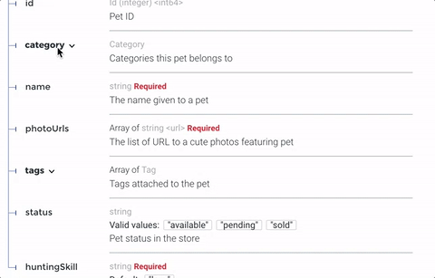
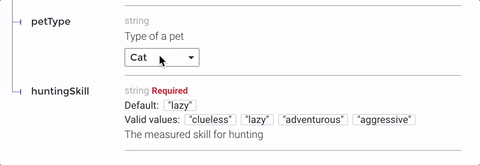
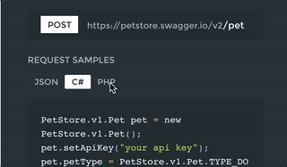

# HUMA-REDOC

**This is a fork of Redoc. This version includes styling changes and implementation of the Execute section for a Huma project.

## About Huma Redoc

[Original Redoc](https://github.com/Redocly/redoc) is an open-source tool for generating documentation from OpenAPI (fka Swagger) definitions. The current version inludes additional features:

- Authentication modal
- Execute section in the right panel

By default Redoc offers a three-panel, responsive layout:

- The left panel contains a search bar and navigation menu.
- The central panel contains the documentation.
- The right panel contains request and response examples.


## New view


## Authentication modal


## Execute section


## Features
- Responsive three-panel design with menu/scrolling synchronization
- [Multiple deployment options](https://redoc.ly/docs/redoc/quickstart/intro/)
- [Server-side rendering (SSR) ready](https://redoc.ly/docs/redoc/quickstart/cli/#redoc-cli-commands)
- Ability to integrate your API introduction into the side menu
- [Simple integration with `create-react-app`](https://redoc.ly/docs/redoc/quickstart/react/)

  [Example repo](https://github.com/APIs-guru/create-react-app-redoc)
- [Command-line interface to bundle your docs into a **zero-dependency** HTML file](https://redoc.ly/docs/redoc/quickstart/cli/)
- Neat **interactive** documentation for nested objects <br>
  

## Development
```bash
npm install
```
```bash
npm start
```

## Build 
```bash
npm run bundle
```

## Publish NPM Package

### Authenticating with a personal access token

To authenticate by adding your personal access token to your `~/.npmrc` file, edit the `~/.npmrc` file for your project to include the following line, replacing GITHUB_TOKEN with your personal access token. Create a new `~/.npmrc` file if one doesn't exist.
```
//npm.pkg.github.com/:_authToken=GITHUB_TOKEN
```
### Publishing a package

Add to an `.npmrc` file to include a line specifying GitHub Packages URL and the account owner.
```
@huma-engineering:registry=https://npm.pkg.github.com
```

Publish the package:
```
npm publish
```

## Customization options
- High-level grouping in side-menu with the [`x-tagGroups`](https://redoc.ly/docs/api-reference-docs/specification-extensions/x-tag-groups/) specification extension
- Branding/customizations using the [`theme` option](https://redoc.ly/docs/api-reference-docs/configuration/theming/)

## Support
- OpenAPI v3.0 support
- Basic OpenAPI v3.1 support
- Broad OpenAPI v2.0 feature support (yes, it supports even `discriminator`) <br>
  
- Code samples support (via vendor extension) <br>
  

## Version Guidance
| Huma Redoc Release | OpenAPI Specification |
|:--------------|:----------------------|
| 1.0.0 | 3.1, 3.0.x, 2.0       |

## Lint OpenAPI definitions

Redocly's OpenAPI CLI is an open source command-line tool that you can use to lint
your OpenAPI definition. Linting helps you to catch errors and inconsistencies in your
OpenAPI definition before publishing.

Refer to [Lint configuration](https://redoc.ly/docs/cli/guides/lint/) in the OpenAPI documentation for more information.

### Final code example

To render your OpenAPI definition using Redoc, use the following HTML code sample and
replace the `spec-url` attribute with the url or local file address to your definition.

```html
<!DOCTYPE html>
<html>
  <head>
    <title>Redoc</title>
    <!-- needed for adaptive design -->
    <meta charset="utf-8"/>
    <meta name="viewport" content="width=device-width, initial-scale=1">
    <link href="https://fonts.googleapis.com/css?family=Montserrat:300,400,700|Roboto:300,400,700" rel="stylesheet">

    <!--
    Redoc doesn't change outer page styles
    -->
    <style>
      body {
        margin: 0;
        padding: 0;
      }
    </style>
  </head>
  <body>
    <redoc spec-url='http://petstore.swagger.io/v2/swagger.json'></redoc>
    <script src="https://cdn.jsdelivr.net/npm/redoc@latest/bundles/redoc.standalone.js"> </script>
  </body>
</html>

```

For step-by-step instructions for how to get started using Redoc
to render your OpenAPI definition, refer to the
[**Redoc quickstart guide**](https://redoc.ly/docs/redoc/quickstart/intro/).

See [**IE11 Support Notes**](docs/usage-with-ie11.md) for information on
IE support for Redoc.

-----------
> The original [redoc repository](https://github.com/Redocly/redoc)